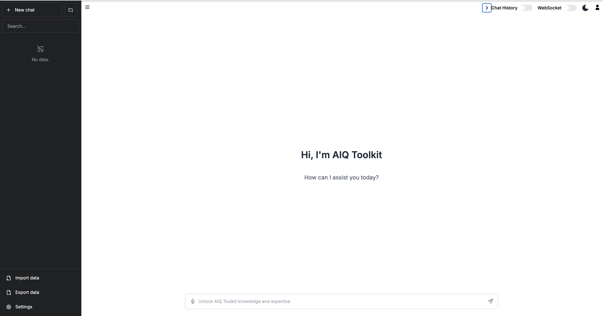
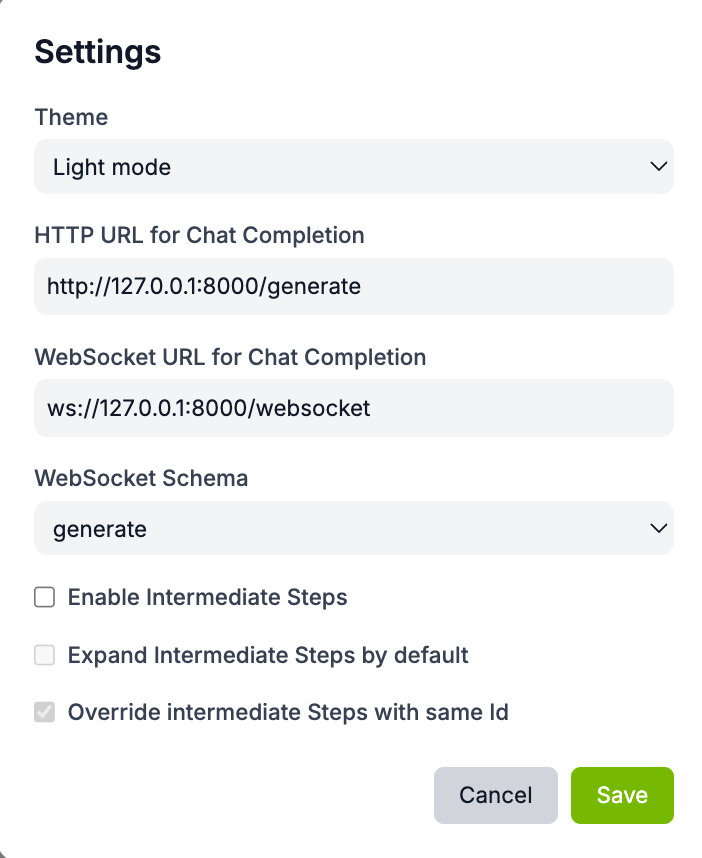
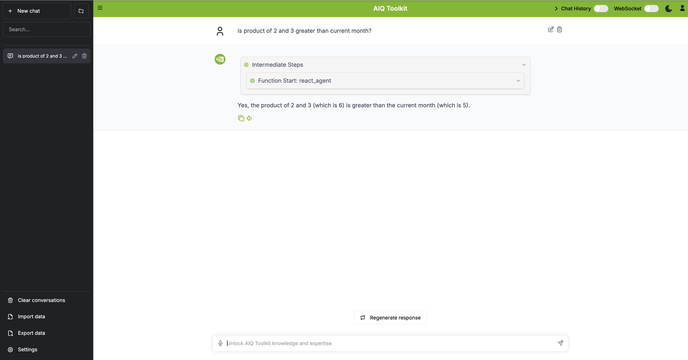

# AIQ Toolkit - UI

[](LICENSE)
[](https://github.com/NVIDIA/AIQToolkit/tree/main)

This is the official frontend user interface component for [AIQ Toolkit](https://github.com/NVIDIA/AIQToolkit/tree/main), an open-source library for building AI agents and workflows.

This project builds upon the work of:
- [chatbot-ui](https://github.com/mckaywrigley/chatbot-ui) by Mckay Wrigley
- [chatbot-ollama](https://github.com/ivanfioravanti/chatbot-ollama) by Ivan Fioravanti

## Features
- 🎨 Modern and responsive user interface
- 🔄 Real-time streaming responses
- 🤝 Human-in-the-loop workflow support
- 🌙 Light/Dark theme
- 🔌 WebSocket and HTTP API integration
- 🐳 Docker support

## Getting Started

### Prerequisites
- [AIQ Toolkit](https://github.com/NVIDIA/AIQToolkit/tree/main) installed and configured
- Git
- Node.js (v18 or higher)
- npm or Docker

### Installation

Clone the repository:
```bash
git clone git@github.com:NVIDIA/AIQToolkit.git
cd AIQToolkit
```

Install dependencies:
```bash
npm ci
```

### Running the Application

#### Local Development
```bash
npm run dev
```
The application will be available at `http://localhost:3000`

#### Docker Deployment
```bash
# Build the Docker image
docker build -t aiqtoolkit-ui .

# Run the container with environment variables from .env
# Ensure the .env file is present before running this command.
# Skip --env-file .env if no overrides are needed.
docker run --env-file .env -p 3000:3000 aiqtoolkit-ui
```



## Configuration

### HTTP API Connection
Settings can be configured by selecting the `Settings` icon located on the bottom left corner of the home page.



### Settings Options
NOTE: Most of the time, you will want to select /chat/stream for intermediate results streaming.

- `Theme`: Light or Dark Theme
- `HTTP URL for Chat Completion`: REST API endpoint
  - /generate - Single response generation
  - /generate/stream - Streaming response generation
  - /chat - Single response chat completion
  - /chat/stream - Streaming chat completion
- `WebSocket URL for Completion`: WebSocket URL to connect to running AIQ Toolkit server
- `WebSocket Schema`: Workflow schema type over WebSocket connection

## Usage Examples

### Simple Calculator Example

#### Setup and Configuration
1. Set up [AIQ Toolkit Get Started ](https://github.com/NVIDIA/AIQToolkit/blob/main/docs/source/intro/get-started.md)
2. Start workflow by following the [Simple Calculator Example](https://github.com/NVIDIA/AIQToolkit/blob/main/examples/simple_calculator/README.md)
```bash
aiq serve --config_file=examples/simple_calculator/configs/config.yml
```

#### Testing the Calculator
Interact with the chat interface by prompting the agent with the message:
```
Is 4 + 4 greater than the current hour of the day?
```



## API Integration

### Server Communication
The UI supports both HTTP requests (OpenAI compatible) and WebSocket connections for server communication. For detailed information about WebSocket messaging integration, please refer to the [WebSocket Documentation](https://github.com/NVIDIA/AIQToolkit/blob/main/docs/source/references/websockets.md) in the AIQ Toolkit documentation.


## License
This project is licensed under the MIT License - see the [LICENSE](LICENSE) file for details. The project includes code from [chatbot-ui](https://github.com/mckaywrigley/chatbot-ui) and [chatbot-ollama](https://github.com/ivanfioravanti/chatbot-ollama), which are also MIT licensed.

